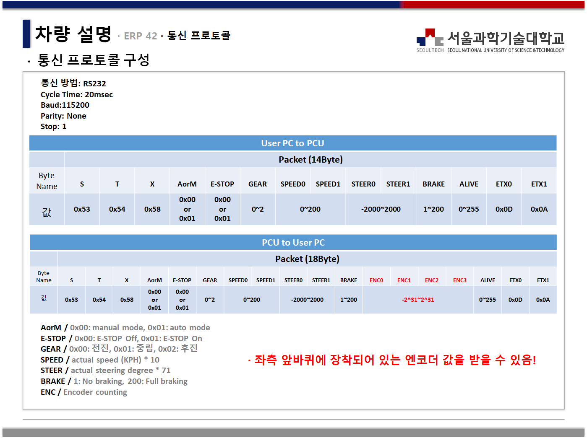

# autonomous-vehicle-MDS

## Overview

- The winner of 2020 국제 대학생 창작자동차 경진대회

[pg)](https://youtu.be/1I9IFRDpORE?t=6298)

## Commands

### sensor setting

``roslaunch stauto_sensor stauto_setting.launch``

### USB cam

``roslaunch usb_cam usb_cam-test.launch ``

### Velodyne lidar

``roslaunch velodyne_pointcloud VLP16_points.launch``

### IMU

``rosrun  pangyo_control get_imu 
``

### Getting ERP42 information (encoder, steer, speed, brake, gear)

``rosrun  stauto_control ERP42_to_PC
``

### GPS

``rosrun  pangyo_control gps_data_pangyo.py 
``
### AMCL

``roslaunch stauto_sensor HyphaROS_MiniCar_Racing.launch ``

## ROSBAG save

``rosbag record -a ``

## ROSBAG play

``rosbag play -($rosbag name).bag --clock --topic -($topics name) ``

## ODOM to trajectory

`` roslaunch odom_to_trajectory create_trajectory.launch ``

## LEGO-LOAM
``roslaunch lego_loam run.launch ``

실시간 확인시 `use_sim_time` 값 false로 변경

## Protocol

## News

- [2020 국제 대학생 창작자동차 경진대회' 시상식](https://www.shinailbo.co.kr/news/articleView.html?idxno=1340335)
- [기계시스템디자인공학과, '한국정밀공학회' 우수상, '전국학생설계경진대회' 은상, '국제 대학생 창작자동차 경진대회' 대상 수상](https://www.seoultech.ac.kr/service/info/news/?do=commonview&searchtext=&searchtype=1&nowpage=10&bnum=3596&bidx=498194&cate=14)
